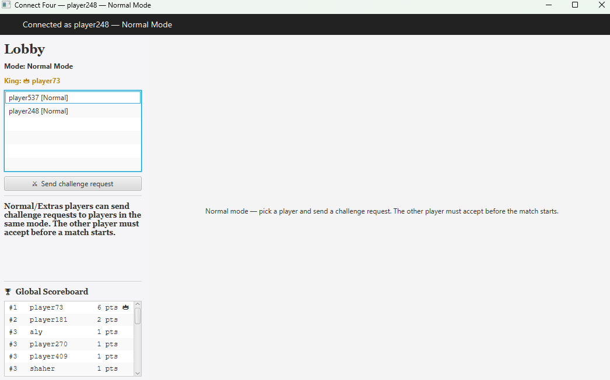
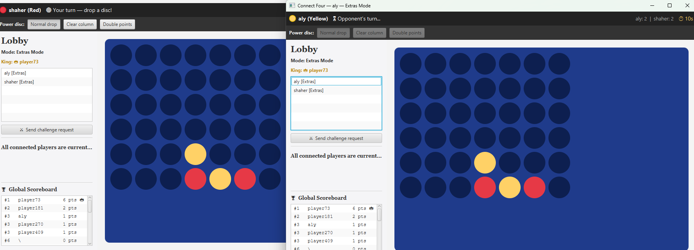

# Advanced Connect Four (Client-Server) 🎮

A feature-rich, multiplayer Connect Four game built with **JavaFX** (Client), **Java Sockets** (Server), and **MySQL** (Database). The project features real-time matchmaking, competitive tournaments, global leaderboards, and custom game modes.

## 🌟 Key Features

* **Client-Server Architecture:** Handles multiple concurrent players using TCP sockets and a thread-pool server.
* **Persistent Database (MySQL):** Tracks player stats (wins, losses, streaks, points), global rankings, and match histories.
* **Dynamic Game Modes:**
  * **Normal Mode:** Classic Connect 4.
  * **Tournament Mode:** Automated 4-player brackets featuring semifinals, a grand final, and a 3rd-place match.
  * **Extras Mode:** 5-in-a-row variant with timed turns and **Power Discs** (Clear Column, Double Points).
* **Interactive Lobby:** Real-time global scoreboard, active king-of-the-hill tracking, and manual challenge requests (Accept/Decline).
* **Match Replays (Highlights):** The server automatically records completed matches into JSON files for replayability.
* **Robust UI:** Smooth JavaFX animations for disc dropping and winning sequences.

## 📸 Screenshots


*Real-time lobby with global leaderboards and challenge system.*


*Extras mode featuring Power Discs and timed turns.*

## 🚀 How to Run

### Prerequisites
* **Java Development Kit (JDK 17+)**
* **MySQL Server (v8.0+)**
* **Maven** (for dependency management)

### 1. Database Setup
The server automatically creates the necessary database schema (tables, indexes, etc.) upon first connection. You only need to have a MySQL server running.

Configure your database credentials using environment variables:
```bash
export C4_DB_HOST=localhost
export C4_DB_PORT=3306
export C4_DB_NAME=connect4
export C4_DB_USER=root
export C4_DB_PASS=your_password_here

## 👨‍💻 Project Team
* Aly Eldeen Ahmed Eldowaik 
* Youssef Mohamed Sayed 
* Nour El Dein Mohamed 
